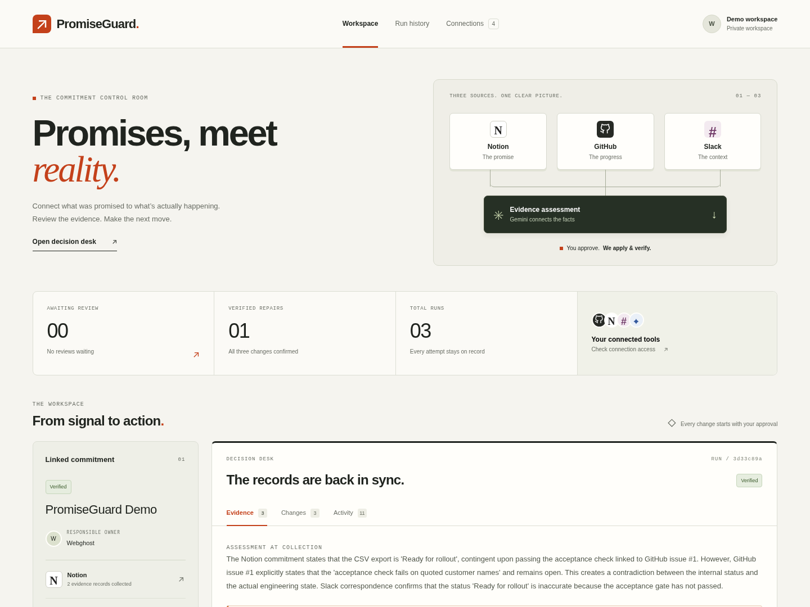
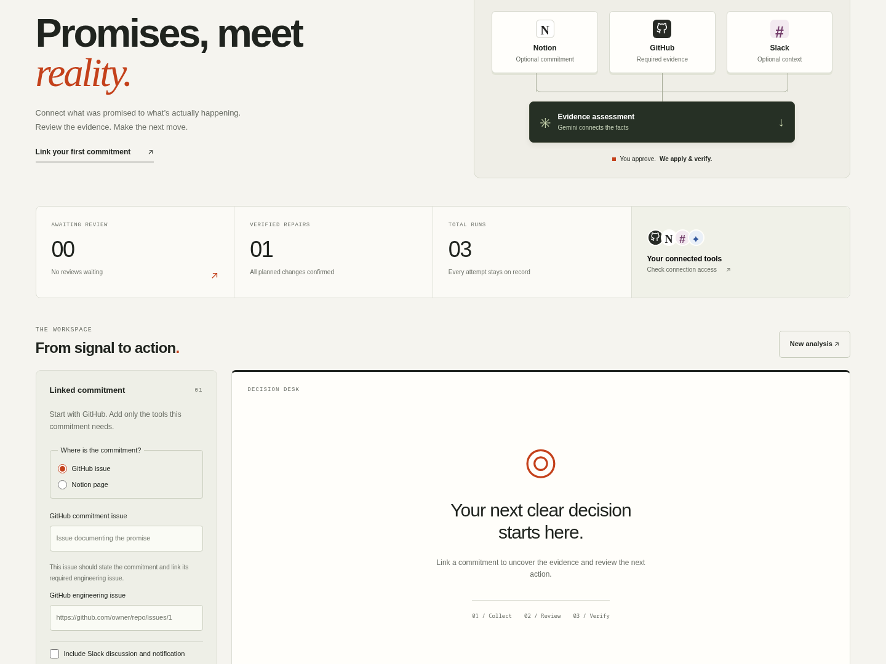

# PromiseGuard

A commitment-reconciliation workspace using Gemini, GitHub, Notion, and Slack. It gathers linked evidence, proposes an exact repair for review, and verifies each approved external change. Users sign in to separate workspaces with Google, GitHub, Slack, or an operator-created password account. Their integration tokens are encrypted per account.



## Run locally

Requires Node 22.13+ with built-in SQLite support. SQLite may print an experimental-feature notice on Node 22.

```bash
git clone https://github.com/Webghost01-NG/promiseguard-demo.git
cd promiseguard-demo
npm ci
cp .env.example .env
# Set GEMINI_API_KEY and any OAuth client credentials in .env (see Credentials below).
bash scripts/setup-account.sh your-name
npm run build
npm start
```

Open http://127.0.0.1:4317. Without public deployment variables, the server binds only to loopback. Rebuild after editing frontend files; restart after server edits.

Local development uses SQLite by default. Set `TURSO_DATABASE_URL`, `TURSO_AUTH_TOKEN`, and a base64-encoded 32-byte `PROMISEGUARD_CREDENTIAL_KEY` to use the same durable Turso storage as a public deployment.

## Credentials

```bash
nano .env
```

Set the server’s `GEMINI_API_KEY` in `.env`. Sign in and save your own GitHub token in Connections. Add Notion and Slack only when needed. These tokens are encrypted in SQLite and scoped to your account; saved values are never returned to the browser. The server does not fall back to the operator’s GitHub, Notion or Slack environment tokens. Click Connections → Check connections to verify authentication. Gemini model-list access does not prove generation quota.

Users can create a password account from the sign-in page. Registration is rate limited and passwords must contain 8–256 characters. Social sign-up is enabled separately for each provider whose client ID and client secret are configured. A provider’s verified immutable user ID is bound to one PromiseGuard account; accounts are never merged from email alone. Register these callback paths for the deployed origin:

- `/api/auth/google/callback`
- `/api/auth/github/callback`
- `/api/auth/slack/callback`

GitHub sign-in requests identity scopes only; users authorize repository workflow access separately in Connections. Slack identity sign-in remains separate from the Slack bot installation because Slack does not allow identity and bot scopes in one OAuth flow.

For repository-scoped workflow access, configure `GITHUB_APP_CLIENT_ID`, `GITHUB_APP_CLIENT_SECRET`, and `GITHUB_APP_SLUG`. Register `/api/connections/github/setup` as the GitHub App setup URL and `/api/connections/github/callback` as its user authorization callback. The install flow lets each user choose repositories, then verifies that installation with an expiring, refreshable GitHub App user token. Connected users can reauthorize without changing repository selection, update installation access separately, or disconnect and revoke the GitHub authorization. Manual tokens remain a local/test fallback.

For optional Slack workflow access, use the existing `SLACK_CLIENT_ID` and `SLACK_CLIENT_SECRET` and configure the app's bot scopes `channels:history` and `chat:write`. The bot installation returns to `/api/auth/slack/callback/connection`, a subpath of the configured OpenID Connect sign-in callback, while separate state records isolate the two flows. Enable Slack distribution before users from other workspaces install the app.

For optional Notion workflow access, create a public OAuth connection with read content, update content, and user-information capabilities. Configure `NOTION_CLIENT_ID` and `NOTION_CLIENT_SECRET`, and register `/api/connections/notion/callback` as its redirect URI. Each installer chooses the pages PromiseGuard can access. OAuth grants are encrypted per PromiseGuard user, refreshed when the provider returns expiring credentials, and revoked remotely on disconnect. Manual Slack and Notion tokens remain available under **Manual token fallback**.

## Existing local workspace

Create your account and explicitly import the existing local records and `.env` workflow tokens once:

```bash
bash scripts/setup-account.sh webghost --claim-local
```

The command prompts for a password without displaying it. Use at least 8 characters. It assigns existing runs and settings without changing their stored plan content. Other accounts start empty. No browser can claim unassigned records. Omit `--claim-local` when provisioning additional accounts.

For local SQLite, keep `data/credentials.key` together with a private database backup. Turso deployments must set `PROMISEGUARD_CREDENTIAL_KEY` to one stable base64-encoded 32-byte key. Losing or changing that key makes saved integration tokens unreadable. Password accounts use salted scrypt hashes; all accounts use eight-hour server sessions and HttpOnly SameSite cookies. Password sign-in has rate limits. Sign-out revokes the session; already-approved background work continues. There is no password-reset UI for operator-created accounts. Social accounts do not have local passwords.

## Deploy for invited testing

The included Render Blueprint runs one free Node instance with HTTPS, health checks, graceful shutdown, and Turso-backed persistence. Turso stores accounts, encrypted OAuth grants, settings, sessions, and run history across Render restarts and redeploys; the local Render filesystem remains disposable.

[Deploy PromiseGuard on Render](https://render.com/deploy?repo=https://github.com/Webghost01-NG/promiseguard-demo)

During Blueprint setup, enter `TURSO_DATABASE_URL`, `TURSO_AUTH_TOKEN`, `PROMISEGUARD_CREDENTIAL_KEY`, `GEMINI_API_KEY`, and the configured providers' OAuth client IDs and secrets. Generate the credential key once with `openssl rand -base64 32`, store it as a Render secret, and retain a private backup. Social sign-in creates a private workspace on first use. You can also open the service Shell and provision an invited password account:

```bash
bash scripts/setup-account.sh tester-name
```

For a repeatable operator account on an ephemeral test deployment, set both `PROMISEGUARD_ADMIN_USER` and `PROMISEGUARD_ADMIN_PASSWORD`. The server creates that account only when the username is absent and never logs the password. A persistent production deployment should provision accounts once and remove these bootstrap variables.

Each tester signs in at the service's `onrender.com` URL and authorizes only the workflow applications they need. Never share one account or token between testers. The app accepts only its exact Render HTTPS origin, sets Secure session cookies and keeps anonymous workspace APIs closed. Enabling Turso creates an empty durable database; records from an earlier ephemeral Render SQLite instance are not copied automatically.

## Prepare actual demo records

Use a GitHub repository you control and whose issues the token can access. The project’s `promiseguard-demo` repository contains an explicitly synthetic demonstration issue. Create an engineering issue you want the app to analyze. The app does not create initial demo records or send setup messages automatically.

For GitHub-only mode, create a separate commitment issue describing the promise and linking its required engineering issue. Select **GitHub issue** as the commitment source. An approved repair posts a handoff comment on the engineering issue; it does not rewrite the commitment issue.

For an optional Notion commitment, on your shared Notion demo page, add plain paragraphs explaining the customer commitment and linking its required GitHub issue. Add exactly one separate plain paragraph beginning `Delivery status:`. This paragraph is the only Notion block the app may replace after approval. Nested blocks are deliberately rejected to avoid silent incomplete evidence collection. This implements the status update on the plain page already created, without requiring a database schema.

If including Slack, in your chosen public Slack channel, ensure the bot is a member. Use a discussion about the same blocker, then use **Copy link** on the discussion message. Paste the entire link; do not retype the timestamp. **Check Slack thread** verifies access and preserves the exact thread link. Reply links containing `thread_ts` resolve to their parent discussion. The app reads that specific thread and posts its approved escalation into that thread.

When selected, Slack is checked before an analysis run is created. A missing message produces a targeted error without saving new targets or starting Gemini. A successful read verifies access, not whether that discussion is relevant to the GitHub issue.

Enter the engineering issue URL, selected commitment source, owner, and Gemini model. Include Slack only when you want its discussion evidence and notification. Analyze sends relevant source text to Gemini but makes no writes to the three workflow apps. Review the exact proposed changes, check the authorization checkbox, then apply. Dismiss a no-longer-needed review before starting another run.

## Execution and recovery

The configured database stores evidence, versioned plan content, action state, returned record IDs, and verification observations. Local development uses Git-ignored SQLite in `data/`; public deployments use Turso when its two variables are set. Approval is bound to a hash of the plan, evidence, and targets. Source changes invalidate the plan. The server executes one run at a time per account, survives browser disconnects, and marks interrupted writes as unknown after a restart.

An unknown write is reconciled against the original provider identity and exact target/content before any retry. Absence from a lookup never automatically authorizes repeating an ambiguous write. When ambiguity cannot be resolved, the run remains partial and new runs are blocked until the operator resolves the external state. This is a deliberate availability tradeoff to prevent blind duplication. There is no universal exactly-once or cross-app transaction guarantee.

Verified actions are rechecked on resume. Notion stale-field checks are best effort; its block update is not a cross-service conditional transaction. If another actor changes a record between a read and a write, a race remains. Slack may normalize text; a mismatch is surfaced as unverified rather than hidden. Rate limits stop a run with a provider message; the user resumes after the indicated interval. There are no background unbounded retries.

Gemini returns a bounded classification and exact source quotations. Code validates source references, quotes, and required evidence, but cannot prove the model's semantic inference. Operator review remains required. An open GitHub issue by itself does not establish a broken commitment.

See the [architecture and reliability brief](docs/reliability.md) for the trust boundaries, failure matrix, measured Gemini evaluation, production security controls, and known limits. The current command and live-service results are tracked in [verification status](docs/verification.md).

The [two-minute judging package](docs/judging-demo.md) provides the exact demonstration script, evidence checklist, architecture frame, proof map, and provider-outage fallback.

## Checks

```bash
npm test
npm run build
npm run evaluate
```

Tests cover target restrictions, evidence grounding, immutable approval content, no-action decisions, and durable restart behavior. Test data is explicitly synthetic unit-test material. The application has no mocked provider path. Live mutation tests must be approved and results reported separately from local tests.

`npm run evaluate` sends 24 explicitly synthetic commitment scenarios to the configured real Gemini model. It performs no GitHub, Notion, or Slack requests and cannot schedule or apply a repair. The balanced corpus covers `repair`, `no_change`, and `clarify`, including GitHub-only workflows, three-app context, contradictory and incomplete evidence, already-accurate status, prompt injection inside untrusted records, and grounded citations. The command writes a credential-free JSON report under Git-ignored `artifacts/` and fails if an API/validation error occurs or decision accuracy is below 75%. It spaces requests five seconds apart to stay below the free-tier 15-requests-per-minute limit. Override the model, threshold, or pacing with `--model`, `--threshold`, and `--interval-ms`.

## Source layout

- `src/`: React operator workspace and responsive styles.
- `server/domain.ts`: target validation, evidence/plan types, grounded assessment checks.
- `server/providers.ts`: real provider REST adapters, collection, analysis, writes and read-back.
- `server/coordinator.ts`: approval, execution, recovery and completion rules.
- `server/database.ts`: serialized local SQLite and remote Turso database adapters.
- `server/store.ts`: owner-scoped run and settings persistence.
- `server/accounts.ts`: credentials, sign-in sessions and explicit legacy import.
- `scripts/setup-account.sh`: terminal account provisioning without exposing passwords.
- `server/index.ts`: local/public HTTP runtime, exact-origin/session checks, health endpoint and static frontend.
- `tests/`: local invariant and persistence checks.

Provider references: [GitHub issue comments](https://docs.github.com/en/rest/issues/comments), [Notion block update](https://developers.notion.com/reference/update-a-block), [Slack discussion reads](https://docs.slack.dev/reference/methods/conversations.replies/), [Slack posting](https://docs.slack.dev/reference/methods/chat.postMessage/), [Gemini structured output](https://ai.google.dev/gemini-api/docs/generate-content/structured-output).

## Current scope

GitHub and Gemini are required. Notion and Slack are optional for each run.

| Selected workflow apps | Approved repair destinations |
| --- | --- |
| GitHub | Engineering issue comment |
| GitHub + Slack | Engineering issue comment, Slack reply |
| GitHub + Notion | Engineering issue comment, Notion status paragraph |
| GitHub + Notion + Slack | All three destinations |



Social sign-up, password sign-in, isolated workspaces, workflow OAuth, and GitHub App repository selection are implemented; see [OAuth onboarding](docs/oauth-onboarding.md).
