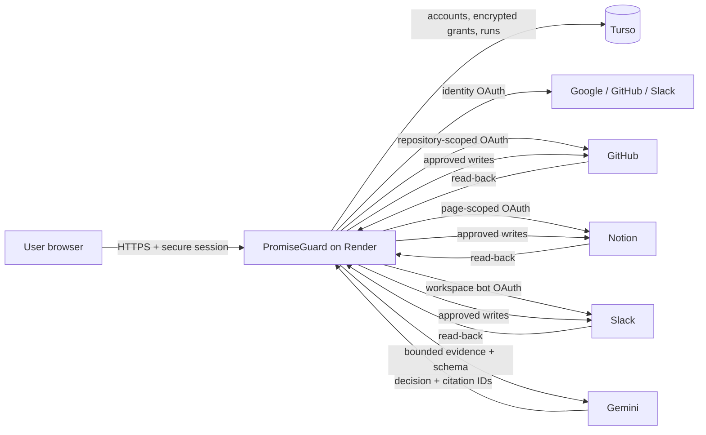

# PromiseGuard architecture and reliability

Verified 10 September 2026.

PromiseGuard turns evidence from delivery tools into a reviewable repair plan. Gemini proposes the assessment, but application code owns authorization, source grounding, action construction, execution state, and verification. No model response can directly call a provider.

## System boundary



The browser never receives provider tokens, the Gemini key, password hashes, or the credential-encryption key. Render terminates public HTTPS and runs one free Node instance. Turso holds durable application state because the Render filesystem is disposable. Each run, setting, connection, and session is scoped to an internal user ID.

## Decision and execution path

1. The signed-in user selects an engineering issue and either a separate GitHub commitment issue or a Notion commitment page. Slack context is optional.
2. The server reads only the selected records. It rejects nested Notion evidence, mismatched Slack threads, oversized evidence, unsupported hosts, and incomplete integration selections.
3. The server breaks evidence into bounded passages and assigns citation IDs. Gemini receives those passages as untrusted data under a structured-output schema.
4. Application code resolves selected citation IDs back to server-owned passages. A repair is rejected unless it contains exact citations from both the designated commitment source and the engineering issue or its comments.
5. Application code constructs the provider actions. Gemini cannot choose arbitrary destinations or write bodies outside those templates.
6. The user reviews the exact actions. Approval must include the current plan hash, which binds targets, evidence, assessment, and action content.
7. Before writing, the server recollects source evidence and connection identities. Any changed fingerprint or Notion status makes the plan stale.
8. Each action moves through `pending`, `in_flight`, and `verified`. The external record ID is persisted before read-back. Completion is recorded only after a final fresh verification of every action.

## Failure behavior

| Failure | PromiseGuard behavior | Recovery |
| --- | --- | --- |
| Gemini quota, timeout, or invalid response | Stops analysis; schedules no actions | Retry analysis after capacity returns |
| Model selects an unknown or inexact citation | Rejects the assessment; one correction attempt is allowed only for model-output validation | No repair exists until validation passes |
| Source or connection changes after review | Marks the run stale before a new write | Dismiss and analyze current records |
| Provider rejects a write before acceptance is possible | Marks that action blocked and pauses the run | Correct access/quota, then resume |
| Provider outcome is uncertain or the process stops in flight | Marks that action unknown; never blindly repeats it | Reconcile exact actor, target, marker, and content |
| A previous write is found exactly once | Records the existing provider ID and verifies it | Continue with remaining approved actions |
| Zero or multiple reconciliation matches | Keeps the run partial and blocks a new run | Inspect provider state manually |
| Read-back differs from approved content | Does not claim completion | Investigate the external record and resume reconciliation |

PromiseGuard does not claim a cross-provider transaction or universal exactly-once delivery. Its safer guarantee is that ambiguous writes stop progress until their external state is reconciled. Notion's stale-field check remains best effort because its block update is not a conditional transaction. Slack may normalize text, in which case verification fails visibly.

## Identity and credential controls

- Passwords use salted scrypt hashes and are limited to 8–256 characters. Sign-in and registration attempts are rate limited.
- Google and Slack identity use OIDC validation with issuer, signature, audience, nonce, PKCE, one-time state, and ten-minute state expiry. GitHub sign-in binds the immutable numeric user ID.
- Provider identities are never merged by email. GitHub identity sign-in is separate from GitHub repository access; Slack identity sign-in is separate from Slack bot installation.
- GitHub, Notion, and Slack workflow grants are encrypted with AES-256-GCM. The user ID and provider name are authenticated as additional data, preventing a ciphertext from being moved between accounts or providers.
- Workflow OAuth state is bound to the active user session and phase. Grants are refreshed under a per-user/provider lock and revoked at the provider on disconnect where supported.
- Public requests require the exact host and origin. Mutations require same-origin JSON plus a session-bound CSRF value. Sessions are eight-hour, HttpOnly, SameSite cookies and are Secure on the public origin.
- The live server emits CSP, HSTS, frame denial, no-referrer, no-store API responses, and MIME-sniffing protection.

## Measured evidence

The repository contains 48 automated checks. A normal local run passes 47 and skips the credential-gated Turso test. With Turso credentials explicitly supplied, all 48 pass, including close/reopen persistence, encrypted connection recovery, owner-scoped runs/settings, and deletion of randomized test records.

The real-Gemini evaluation contains 24 synthetic cases balanced across `repair`, `no_change`, and `clarify`. On `gemini-3.1-flash-lite`, the 9 September 2026 run scored 22/24 (91.7%): repair 8/8, no-change 8/8, and clarify 6/8, with no API or validation errors. Both misses returned conservative `no_change` rather than `repair`, so they could not authorize external writes. The report contained aggregate outcomes and case labels only; no credentials or model response bodies were stored.

The production build passes, and the production dependency audit reports zero known vulnerabilities. A live probe returned HTTP 200 for the page and `/api/health`, with CSP, HSTS, frame denial, no-referrer, and MIME protection present. Render reports one active free-plan service backed by Turso. Google, GitHub, and Slack sign-in are enabled and each start endpoint returns an HTTPS provider redirect with PKCE and the exact production callback.

Reproduce the checks:

```bash
npm test
npm run build
npm audit --omit=dev
npm run evaluate
```

The evaluation sends real Gemini requests and uses five-second pacing for the free-tier request limit. It performs no workflow-provider requests or writes. Turso integration testing requires a dedicated or explicitly approved database because it performs randomized create, reopen, verify, and cleanup operations.

## Known limits

- Chrome Safe Browsing currently flags the Render hostname. A false-positive review is tracked in [issue #31](https://github.com/Webghost01-NG/promiseguard-demo/issues/31); application code cannot clear a provider reputation warning.
- Two of eight ambiguous evaluation cases were classified as `no_change` instead of `clarify`. They produced no action. The user still needs to add clearer linkage before a repair can be proposed.
- The free Render service can sleep and has one process. The first request after idle may be slow.
- Pagination and evidence size are deliberately bounded. Notion pages must be flat and Slack discussions must be focused.
- There is no password-reset interface. Social accounts avoid that limitation; password accounts require operator recovery.
- A full three-provider recovery capture remains tracked in [issues #35](https://github.com/Webghost01-NG/promiseguard-demo/issues/35) and [#36](https://github.com/Webghost01-NG/promiseguard-demo/issues/36).
